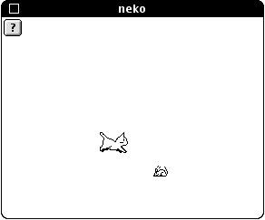

# Neko

Neko is a cross-platform open-source animated cursor-chasing cat screenmate application.

## Article

[Neko: A History of a Software Pet](https://eliotakira.com/neko/)

## New

- [Icon library: Collection of Neko variants found in the wild](/2023-icon-library)
- [jneko - JavaScript implementation of Neko](https://github.com/evert/jneko)
- [neko - A complete re-implementation in Go, using the Ebiten gaming library](https://github.com/crgimenes/neko)

## Archive

This is a historical archive of source code related to the Neko project.

- [1988 - NEKO.COM (NEC PC-9801)](/1988-pc98)
- [1989 - Neko DA (Macintosh)](/1989-macintosh-neko-da)
- [1990 - xneko (X Windows)](/1990-xneko)
- [1991 - Cat and Mouse (OS/2)](/1991-os2-cat-and-mouse)
- [1991 - WNEKO (Windows 3.x)](/1991-wneko)
- [1992 - Neko Runs Free (Windows 3.x)](/1992-neko-for-windows-3)
- [1993 - Ameko (Amiga)](/1993-amiga)
- [1993 - oneko (Linux)](/1993-linux-oneko)
- [1997 - Icon Libraries (Windows)](/1997-icon-libraries)
- [1998 - Neko98 (Windows)](/1998-windows-neko98)
- [2000 - Replicat (BeOS)](/2000-beos-replicat)
- [2000 - Neko Saver (Macintosh)](/2000-neko-saver-for-macintosh)
- [2004 - webneko (JavaScript)](/2004-webneko)
- [2010 - Neko in Java](/2010-neko-in-java)
- [2010 - Neko touchscreen program (Arduino)](/2010-arduino)
- [2010 - Neko x64 (Windows)](/2010-neko-x64)
- [2011 - ANeko (Android)](/2011-aneko)

## Screenshots

#### Neko DA for Macintosh

#### Neko for Windows 3

#### Cat and Mouse for OS/2

#### Neko98

## References

- [Neko (ソフトウェア)](https://ja.wikipedia.org/wiki/Neko_(%E3%82%BD%E3%83%95%E3%83%88%E3%82%A6%E3%82%A7%E3%82%A2))
